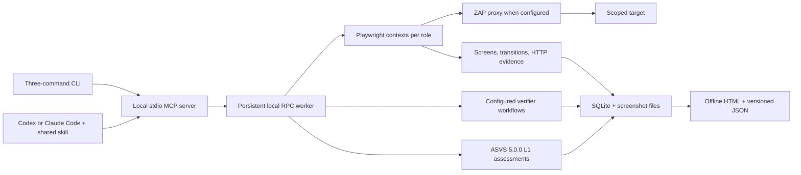

# Architecture and MVP boundaries

The built-in CLI controller handles routine discovery. Codex or Claude Code can instead maintain the role/state/action frontier through the shared MCP skill when application-specific reasoning is useful. The scanner does not launch another LLM or enumerate every route from source code.

## State, concurrency and failures

The stdio MCP process is a client adapter. It locates or starts a persistent worker for its `FLOWAUDIT_DATA` directory, then calls that worker over authenticated HTTP RPC bound to loopback. Its local `worker.json` records the worker address and access token with restrictive file permissions; it is runtime state and must not be shared as report evidence. The worker owns the SQLite process lock, browser sessions and background jobs. SQLite stores each scan's versioned aggregate data and its project configuration. Screenshots live in a per-scan `screens/` directory. The default local state directory is `.runs`; Docker uses `/data`, bound to the host's `scan-data/` directory.

Only one scan may remain `running` in that store. Browser and verifier operations are serialized. Long security checks return a job ID immediately; callers read job outcomes through `scan_status` before starting another operation. A client or stdio-adapter disconnect leaves the persistent worker running, so another connection using the same state directory and scan ID can continue the live browser sessions. If the worker itself stops or crashes, scans left `running` become `interrupted`, with artifacts retained. Start a new scan to regain browser control after worker loss; exporting and reading interrupted results does not need the original browser.

`npm run worker:stop` shuts down the local worker selected by `FLOWAUDIT_DATA`, preserving unfinished scans as interrupted. In Docker, stop the stack with Compose. Changing code or worker environment requires a rebuild and intentional worker restart; an existing worker retains the environment it started with.

The time budget starts when the scan is created and includes time spent between conversational decisions and client disconnects. Finishing marks the operator's workflow complete while preserving `coverage.complete: false`; this MVP makes no exhaustive-coverage claim. Export computes a frontier from observed actions and recorded transitions, identifying visited, blocked and unvisited controls. Discovered-but-unvisited actions are also exposed as coverage blockers. This covers the observed UI frontier, not unknown routes or every possible form input. Failed checks, blocked redirects, unsupported browser surfaces and budget limits remain visible.

## Browser coverage and replay

The recorder uses Chromium with a 1280×850 viewport and captures the current viewport. Its actionable surface consists of visible links, buttons, inputs, selects, textareas and elements with button/tab roles in the main document. Each observation exposes at most 120 candidate controls. It records a new observation even when the state groups into an existing graph node.

Grouping includes role, origin/path/query, visible control structure and dialog state. Tabs and dialogs can therefore produce distinct nodes at the same URL. This is a heuristic UI grouping: text-only changes that leave the URL and relevant structure unchanged can group into the same node. Screenshots belong to the grouped state, not to every timestamp. Inspect HTTP evidence and observations when evaluating dynamic content.

Replay starts from the configured target and finds the current action by action kind and label, then uses the newly observed action ID. This avoids hardcoding resource URLs from a previous run, but requires stable, sufficiently distinct labels. A missing action stops replay with a rediscovery blocker. It is not a recorded JavaScript macro that reconstructs arbitrary SPA state.

Popups, WebSockets and service workers are deliberately unavailable to the current recorder. Popup and WebSocket discoveries are recorded as blockers. Nested frames, shadow-root-only controls, file upload interaction, drag-and-drop, mobile layouts and canvas controls do not have dedicated exploration support in this MVP. Record their coverage gaps when observed; do not count them as tested. Browser JavaScript dialogs are dismissed.

## Scope, authentication and checks

Scope is the target's HTTP(S) origin plus included path prefixes minus excluded path prefixes. Prefixes are literal decoded path prefixes, not regular expressions or route templates. Requests and redirects go through this check. Mutation and dangerous-action policy is enforced in code; use exact allowed endpoint paths in configuration for permitted fixture actions. Logging out is reserved for the session test.

Captured browser-state, form, cookie and bearer profiles reference a local secret-file entry. Each role must have a protected probe URL and a response marker that positively identifies authenticated content. A publicly accessible probe would undermine the authentication check, so use a truly protected endpoint. `flowaudit init` captures cookies and same-origin local storage after the user completes login, including federated login, MFA or CAPTCHA in the visible browser. The scan target remains single-origin. The configured form selectors must identify the login controls when using the advanced form profile.

The fixture verifiers are configured workflows for reflected XSS execution, function/object access rules and session reuse after logout. Authorization cases need an owner role, an explicitly unauthorized role, a current-resource discovery selector and protected-content marker. Their result is only as meaningful as that supplied access policy and baseline. The scanner does not infer an organization's permission model from button visibility or HTTP status alone.

Passive ZAP processing evaluates captured in-scope traffic. Active ZAP execution defaults to reflected XSS rule **40012**, with no recursion, against observed or explicitly configured **GET endpoints with query parameters**. An explicit `tests.activeScan` configuration can select the `deep` interpreter-focused profile, attack strength, installed scanner IDs, path-only endpoints, discovery paths and observed POST request shapes. Request shapes are deduplicated by method, path and input names before scanning. POST requires the method in the active profile, an exact `allowedActions` path and an observed URL-encoded or JSON body; stale or single-use CSRF tokens can still make a POST campaign inconclusive.

The adapter uses a dedicated capture session/context/policy, independently probes authentication and installs a scoped outbound HTTP-sender guard. The guard strips the internal correlation header, applies role credentials only to allowed requests and blocks disallowed origins, paths, methods, non-allowlisted mutations and expired heartbeats. ZAP candidates remain `needs-review` until separately verified.

The optional login-input verifier is separate from ZAP active scanning. An explicit `tests.login` profile authorizes one POST endpoint and 2-10 attempts. It reloads the login page for fresh cookies and CSRF state, submits a unique invalid baseline plus bounded SQLi, XSS and template cases, and never guesses a real account password. A database error, observed marker execution or configured protected success marker can confirm a finding; other response differences stay `needs-review`.

The complete L1 checklist stays present even where automated checks cannot assess a requirement. The 70 pinned requirements carry original text and review/evidence guidance. A confirmed counterexample can establish a scoped failure. Non-reproduction still leaves the wider requirement for review; source, architecture and configuration requirements cannot be established solely through this browser.

## Reports and distribution

The report bundles React, the graph renderer, captured data and screenshot images into one HTML file. Its content security policy denies network connections, and captured application text is rendered as text. The companion JSON uses schema version 1. Screenshots mask input/textarea controls, known secret-bearing elements and configured sensitive selectors; textual evidence is redacted separately. Application-specific confidential content still needs suitable selectors. Missing or unsafe screenshot paths become report warnings instead of external file reads.

The Codex and Claude bundles contain identical skill content and point at the same launcher. They are local development deliverables and do not automatically install into a user's marketplace or client settings. See `plugins.md` for separate protocol-level and actual-client acceptance checks.

## Live ZAP acceptance

The dedicated ZAP 2.17.0 integration passed authenticated active reflected-XSS detection, blocked out-of-origin requests, forbidden payment POST, external redirect suppression, heartbeat expiry and correlation-header checks. ZAP starts a new unsaved session before each scanner capture; use only a dedicated instance. Active coverage is rule 40012 on safe GET query endpoints and is described in report notes.
